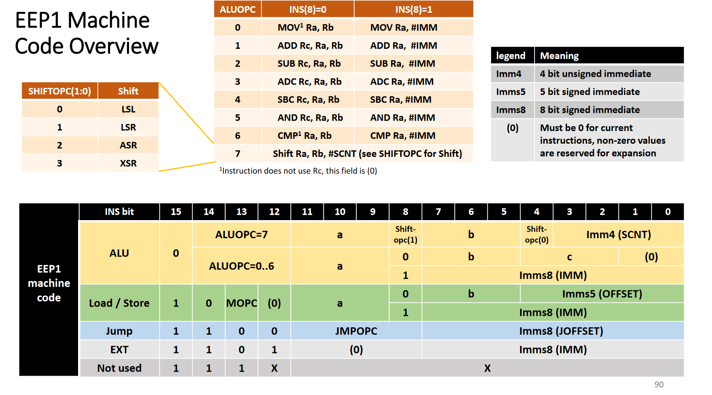

# EEP1 assembler

Usage:

```
eepasm infile outfile
```

## Specifcations of EEP1 assembly and machine code encoding

Main specification:



Jump instructions specification:


Memory load/store instruction specification:


