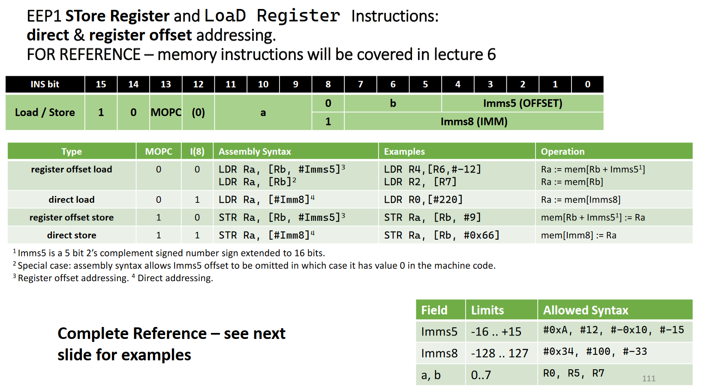

# Extendable EEP1 assembler

An assembler for EEP0 and EEP1 CPU as taught at Imperial College 2022.

This is an alternative version of [Tom Clarke's EEP1 assembler](https://github.com/tomcl/eepAssembler) with one major advantage:

**new custom instructions can be added via a configuration file without the need to change the code**.

## Compilation

```
clang++ eepasm.cpp -o eepasm
```

or

```
g++ eepasm.cpp -o eepasm
```

## Command usage

First move your instruction config file into `inslist.eepc` which needs to be in
the same directory as the `eepasm` binary.

Then run

```
eepasm [-o outfile] [-c configfile] infile
```

* `-o` to set output machine code file (**default**: `out.ram`)
* `-c` to set input configuration file with instruction list (**default**: `inslist.eepc`)

## Instruction definition configuration file format

The ISA specification should go into a configuration file like `inslist.eepc`.
By default `eepasm` will try to read the file `inslist.eepc` located in the same folder as the binary.

You can override this by using the `-c` option (see [command usage](#command-usage)).

The given default `inslist.eepc` just implements to main EEP1 ISA as specified [below](#specifcations-of-eep1-assembly-and-machine-code-encoding).

DISCLAIMER: ALL CONFIGURATION KEYWORDS ARE CASE INSENSITIVE

### Top level format

Basically you list instructions in the following kind of hierarchy (for one instruction):

* list of instruction names
* for every instruction:
	* list of alternatives of the instruction (e.g. with 3 register operands or 1 register and an immediate operand)
	* for every alternative:
		* list of operands
		* for every operand specify certain properties (depend on the operands; see [below](#operand-type-properties)); e.g.:
			* *Type*: type of operand (just a string value)
			* *Least significant bit*: where in the instruction word operand data will be stored
			* *Size*: size in bits of operand in instruction word
	* a numeric value for the constant part of that instruction, i.e. the part that does not change depending on your operands

Example for `ADD` instruction:

* `numops` states the start of an instruction alternative: *here* we have a 2 and a 3 operand instruction
* `op`: states start of operand property list
* `type`: type of operand (`reg` for register, `imm` for immediate)
* `size`: size of immediate (not necessary for `reg` because register addresses have constant size 3)
* `const_iword`: contains ALUOPC=1 for `ADD` instruction and most significant bit set to 0 to indicate ALU instruction (this is the same for all alternatives)

```
ADD
	numops	2
	op
		type	reg
		lsb 	9
	op
		type	imm
		size	8
		lsb	0
		ins8	1
	numops	3
	op
		type	reg
		lsb	2
	op
		type	reg
		lsb	9
	op
		type	reg
		lsb	5
	const_iword	0b0001000000000000
```

### `copy` to save retyping configurations

If different instructions have the same alternatives of operand combinations you
can just use the `copy` keyword instead of an alternatives list to copy the alternatives
from the instruction right above.

For example like this to make `ADD` and `SUB` have the same format:

```
ADD
	numops	2
	op
		type	reg
		lsb 	9
	op
		type	imm
		size	8
		lsb	0
		ins8	1
	numops	3
	op
		type	reg
		lsb	2
	op
		type	reg
		lsb	9
	op
		type	reg
		lsb	5
	const_iword	0b0001000000000000
SUB
	copy
	const_iword	0b0010000000000000
```

**Note**: `const_iword` is always separate.

### Operand type properties

`reg`:

* `type`: set to `reg`
* `lsb`: least significant bit of register address (in EEP1 we have C->2, A->9, B->5)

`imm`:

* `type`: set to `imm`
* `size`: immediate size in bits
* `lsb`: least significant bit in instruction word
* `ins8`: 1 if bit 8 of instruction word should be set (otherwise 0); this is needed for 8 bit immediates in ALU and memory instructions

`label`:

* `type`: set to `label`

Inserts 8 bit offset value corresponding to given label.

Used for JUMP instructions.

`pcx`:

* `type`: set to `pcx`
* `const`: specifies a constant value that is added to the instruction word (this can be used to change the instruction depending on which operand of the instruction `pcx` is)

Used for interrupts to save PCX (saved program counter) in register (e.g. `MOV R0, PCX`) and restore it (e.g. `MOV PCX, R0`)

`flags`:

* `type`: set to `flags`
* `const`: same as for `pcx`

Used for interrupts to save flags in register (e.g. `MOV R0, Flags` and restore them (e.g. `MOV Flags, R0`).


### Built-in 2 operand shortcuts for 3 operand instructions

If only 2 operands are given the first one will be duplicated.

## Adding custom instructions

Refer to the format of the given `inslist.eepc` to see how instructions are specified and just append them to the file.

## Specifcations of EEP1 assembly and machine code encoding

Main specification:


Jump instructions specification:


Memory load/store instruction specification:


