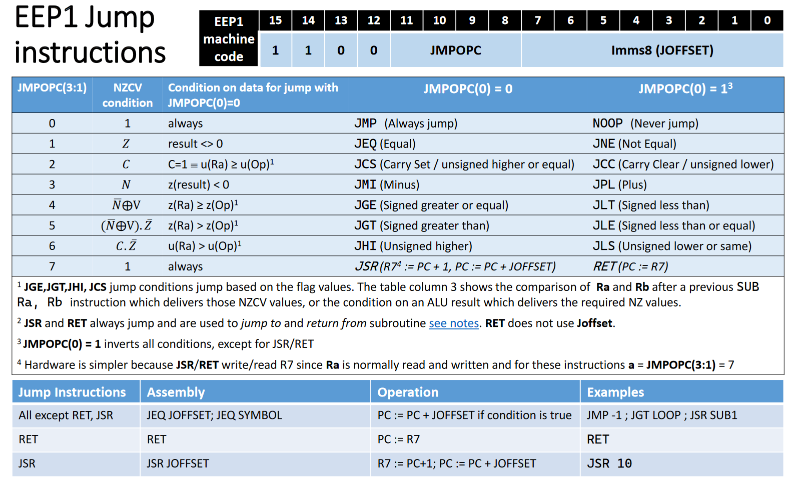

# EEP1 assembler

## Compilation

```
clang++ eepasm.cpp -o eepasm
```

or

```
g++ eepasm.cpp -o eepasm
```

## Usage

First move your instruction config file into `inslist.eepc` which needs to be in
the same directory as the `eepasm` binary.

Then run

```
eepasm infile outfile
```

## Adding custom instructions

Refer to the format of the given `inslist.eepc` to see how instructions are specified and just append them to the file.

## Specifcations of EEP1 assembly and machine code encoding

Main specification:


Jump instructions specification:



Memory load/store instruction specification:


